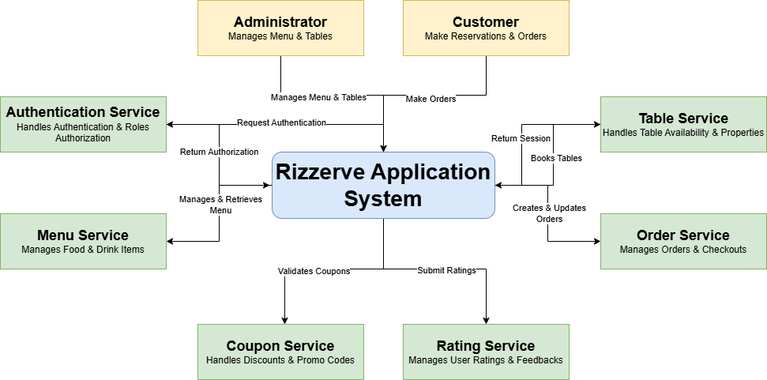
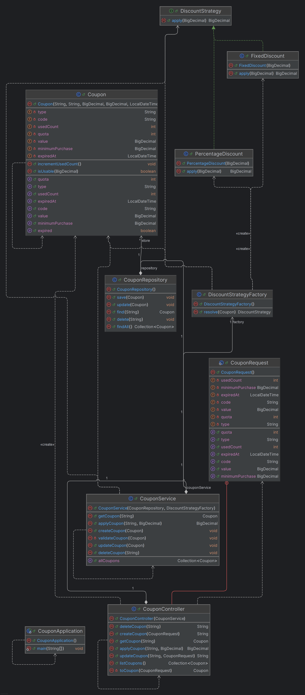

# Diagram A17 - Rizzerve
- Context Diagram
  

- Container Diagram
  

- Deployment Diagram
  
-architecture risk:
  

future architecture

Kami memilih teknik risk storming karena cara ini membuat semua anggota tim bicara tentang kemungkinan masalah sejak awal. Setiap orang memberi ide tentang apa yang bisa salah dan apa akibatnya. Setelah itu, kami menilai mana yang paling penting berdasarkan seberapa sering bisa terjadi dan seberapa besar gangguannya.
Untuk resiko “Satu Database untuk Banyak Layanan”, kami lihat bahwa memakai satu database memang cepat saat mulai, tapi bisa jadi titik gagal tunggal. Jika satu layanan mengubah skema, layanan lain bisa rusak. Saat trafik tinggi, database itu bisa kewalahan. Solusinya adalah pisahkan database untuk tiap layanan. Dengan begitu, perubahan skema di satu layanan tidak mengganggu yang lain, kapasitas bisa ditambah sesuai kebutuhan, dan sistem lebih mudah dipulihkan jika terjadi masalah.
Pada resiko “Bentrokan Saat Booking Meja”, banyak pengguna bisa pesan meja bersamaan dan menyebabkan double booking. Kami sepakat menggunakan optimistic locking atau kunci terdistribusi lewat Redis. Cara ini hanya mengunci data yang sedang diproses, bukan seluruh tabel. Jika ada dua permintaan bentrok, satu akan gagal dan dicoba ulang. Dengan begitu, meja tidak bisa dipakai dua kali dan pengalaman pengguna tetap mulus.
---

# Individual (Fadhlurohman Dzaki - 2306202132)
- component 

- code
